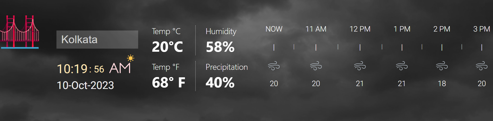
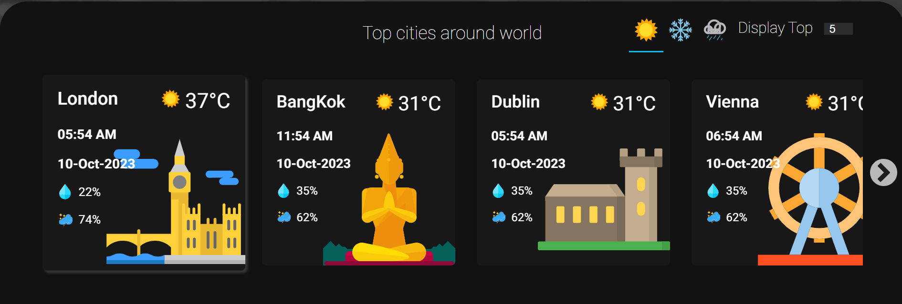
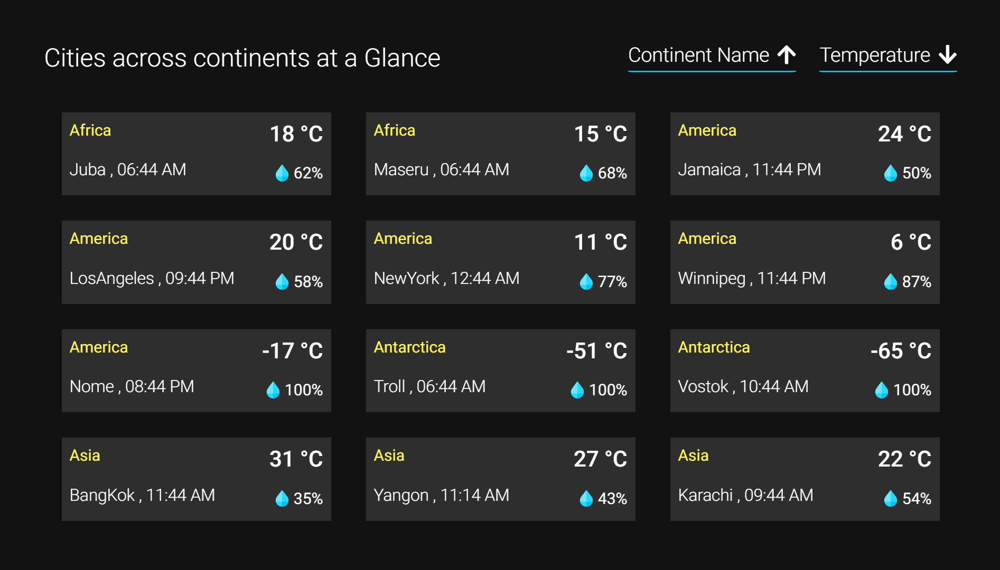

# WEATHER APPLICATION

It is a weather forecasting application to represent the weather and other climatic conditions of different cities. This web application is developed using HTML, CSS, JAVASCRIPT.
The application consists of three sections top, middle and bottom.

---

## TOP SECTION - Weather Information of The selected city

A city name is given as input or selected from the datalist drop down and information such as temperature in celsius, temperature in fahrenheit, humidity and precipitation is displayed along with the temperature of the city for the next 5 hours.

if the input is an invalid name, then the top section would show error for all the data fields

---

## MIDDLE SECTION - Weather conditions for the list of city

The list of the city cards are displayed based on the user clicking the preference icons sunny, windy or snowy. The number of city cards to be displayed is changed using the spinner input.

We can also change the city displayed in the top section by clicking the desired city card in the middle section 

---

## BOTTOM SECTION - Continent wise weather condition for the list of city.

The list of cities will be displayed by sorting based on the continent names and/or temperature in ascending or descending order

---

## HOST URL

http://localhost:5500/
